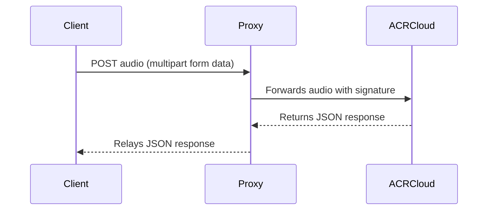

# ACR Cloud Local Proxy

**ACR Cloud Local Proxy** is a lightweight, stateless Go server that acts as an intermediary between
client applications and the ACR Cloud audio recognition service. It securely handles the necessary
HMAC-SHA1 signature generation and forwards incoming audio data to ACR Cloud, relaying the JSON
response back to the client.

> **Note:**
> This project is intended as a proof-of-concept (POC). For production usage, consider implementing
> additional security measures, error handling, and HTTPS support.

## Features

- **Secure Proxying:** Handles API credential signing and communication with ACR Cloud.
- **Simplified Client Integration:** Accepts audio data from the client via the `/recognize`
  endpoint.
- **Real-Time Response:** Forwards the JSON response from ACR Cloud directly back to the client.

## Prerequisites

- Go 1.23 or higher

## Setup

1. **Configure Your Credentials:**
   In the `main.go` file, update the following constants with your actual ACR Cloud credentials:
   ```go
   const (
       accessKey    = "YOUR_ACCESS_KEY"
       accessSecret = "YOUR_ACCESS_SECRET"
   )
   ```
   Also, adjust the `acrURL` if necessary.

2. **Run the Application:**
   Build and run the server with the following command:
   ```bash
   go run main.go
   ```
   The proxy will start listening on [http://localhost:8080](http://localhost:8080).

## Endpoints

### `/recognize`

- **Method:** `POST`
- **Description:**
  Accepts a multipart form submission containing an audio file (form field name: `audio`). The proxy
  processes the audio, signs the request, and forwards it to ACR Cloud. The JSON response from ACR
  Cloud is then relayed back to the client.
- **Example:**
  ```bash
  curl -X POST http://localhost:8080/recognize \
       -F "audio=@/path/to/your/audiofile.mp3"
  ```

### `/health` *(Optional)*

You may add a `/health` endpoint to check the status of the proxy. For example, a simple
implementation could return a 200 status with a JSON message:

```bash
curl http://localhost:8080/health
```

*(Note: This endpoint is not implemented in the provided code. Feel free to add it if needed.)*

## Running with Docker

You can also containerize the proxy for quick testing or deployment:

1. **Build the Docker Image:**
   ```bash
   docker build -t acr-cloud-proxy .
   ```

2. **Run the Docker Container:**
   ```bash
   docker run -p 8080:8080 acr-cloud-proxy
   ```

## Build Process with Makefile

If you have a Makefile in your repository, you can simplify common tasks. For example, to see all
available commands:

```bash
make help
```

*(If a Makefile is not present, consider adding one to streamline your build and deployment
process.)*

## System Flow Overview

The general workflow of the proxy is illustrated below:



## Contributing

Contributions are welcome! Please ensure your code adheres to the project's style guidelines. Here
are some helpful commands:

- **Format Code:**
  ```bash
  go fmt ./...
  ```

- **Lint Code:**
  ```bash
  go vet ./...
  ```

All commits should follow the [Conventional Commits](https://www.conventionalcommits.org/en/v1.0.0/)
specification. To help enforce this, consider setting up a pre-commit hook:

```bash
git config core.hooksPath .githooks
```

Refer to our [Contribution Guide](docs/CONTRIBUTING.md) for more details.

## License

This project is licensed under the [MIT License](LICENSE).
